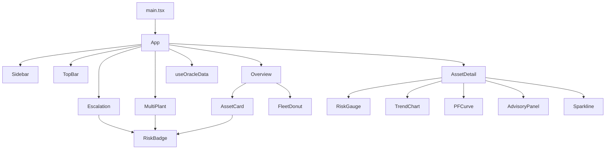
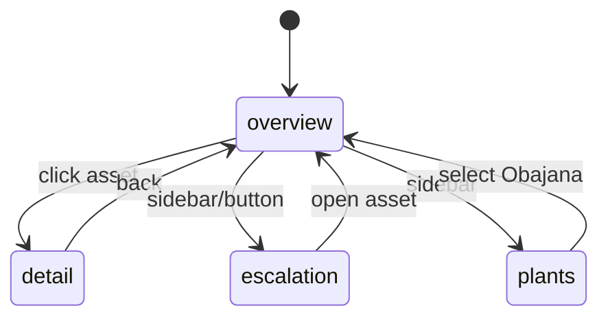

# Oracle Predictive Maintenance Dashboard - Detailed Project Guide

## 1. Project Summary

This repository contains a frontend dashboard for predictive maintenance in industrial operations.

The application visualizes risk posture and remaining useful life (RUL) of assets, then routes users through:

- Fleet overview and KPI summaries
- Asset-level drill down with trend and factor analysis
- Escalation workflow grouped by severity
- Multi-plant aggregate view

The dashboard currently runs on deterministic seed data plus simulated near-real-time updates from a local hook.

## 2. Business Domain Model

The project models condition-based maintenance with a practical risk/escalation framework:

- Tier model:
  - green = normal operation
  - amber = degrading condition requiring inspection
  - red = imminent failure requiring immediate work order

- RUL model:
  - Numeric estimate in days (rul_estimate_days)
  - Human-readable display text (rul_display)

- P-F curve model:
  - Zone 1: Normal
  - Zone 2: Early Degradation
  - Zone 3: Accelerating
  - Zone 4: Imminent Failure

- Escalation model:
  - logged_only
  - flagged_for_inspection
  - work_order_generated

## 3. Technology Stack

### Core runtime

- React 18
- Vite 6
- TypeScript (in TSX modules)

### UI, styling, and interaction

- Tailwind CSS v4
- Radix UI primitives (large reusable UI component set in src/app/components/ui)
- Lucide icons
- motion/react (animations and presence transitions)
- Recharts (trend visualization)

### Selected utility libraries present in dependencies

- clsx and tailwind-merge for class composition
- react-hook-form, date-fns, sonner, embla-carousel and others for generic UI support

## 4. Repository Structure

Top-level structure relevant to app behavior:

- index.html: Vite entry HTML shell
- src/main.tsx: React mount point
- src/app/App.tsx: main layout and view router/state coordinator
- src/app/components/: feature components and domain types/data
- src/styles/: imported style layers and theme variables
- guidelines/Guidelines.md: template for custom AI generation rules
- README.md: minimal bootstrap instructions

## 5. Boot and Runtime Flow

1. src/main.tsx mounts App into #root.
2. App initializes local UI state:
   - current view (overview | escalation | plants)
   - selected asset id (null or specific asset)
3. App calls useOracleData() to obtain live-updating assets.
4. App derives count summaries and top bar headers from current state.
5. App conditionally renders one of these screen paths:
   - Overview (fleet cards)
   - AssetDetail (single selected asset)
   - Escalation (tier columns)
   - MultiPlant (plant roll-up cards)
6. AnimatePresence and motion wrappers provide fade transitions between views.

## 6. Architecture Overview

### 6.1 Container/presentation boundaries

- Container/orchestrator:
  - App.tsx handles screen routing and selected-asset context

- Domain state simulation:
  - useOracleData.ts updates risk, RUL, tier, trend samples on interval

- Presentational feature views:
  - Overview.tsx
  - AssetDetail.tsx
  - Escalation.tsx
  - MultiPlant.tsx

- Shared visual primitives:
  - RiskBadge, RiskGauge, TrendChart, PFCurve, Sparkline, FleetDonut

### 6.2 High-level component graph

### 6.3 Navigation state diagram

## 7. Data Contract and Types

The canonical domain types and seed payloads are centralized in src/app/components/data.ts.

### 7.1 Key exported types

- Tier
- PFZone
- FactorKey
- TrendDirection
- AdvisoryUrgency
- EscalationStatus
- EscalationNotify
- DrivingFactor
- TrendPoint
- Advisory
- Escalation
- Asset
- Plant

### 7.2 Contract design characteristics

- Closed vocabularies for risk and escalation fields
- Consistent object shape across assets
- Fixed driving factors list intended to remain stable
- Display-ready fields included in payload (example: rul_display)
- Seed assets include:
  - kiln_id_fan (amber)
  - raw_mill (green)
  - cement_mill (red)

### 7.3 Styling/domain constants in data layer

- COLORS
- tierColor mapping
- tierRank ranking for urgency sorting
- pfZoneMeta labels/positions
- escalationLabel and escalationDetail maps

This approach keeps copy, semantics, and visual status mapping consistent across views.

## 8. Simulated Real-Time Update Engine

The hook useOracleData(intervalMs = 3500) is the local telemetry simulator.

### 8.1 Update behavior per tick

For each asset:

- Compute bias based on current tier
- Apply stochastic delta to risk_score with clamp
- Recompute rul_estimate_days with bounded drift
- Recompute tier from score thresholds
- Append one trend point and drop oldest point
- Rebuild rul_display text using days/hours/weeks format logic
- Update last_updated to current ISO time

### 8.2 Threshold mapping

- score >= 75 -> red
- score >= 45 and < 75 -> amber
- score < 45 -> green

## 9. Screen-by-Screen Functional Detail

### 9.1 Sidebar

- Left navigation shown on md+ screens
- Displays active view and escalation badge count
- Contains support/settings placeholders and static user card

### 9.2 TopBar

- Dynamic title/subtitle provided by App
- Live-feed status pill
- Search input (visual only)
- Notification bell with red indicator

### 9.3 Overview

- KPI cards:
  - Assets needing action
  - Soonest predicted failure
  - Healthy assets
  - Escalation queue CTA
- Fleet health donut chart
- Monitored asset cards sorted by urgency via tierRank

### 9.4 AssetCard

- Displays RUL, risk score, PF zone, and sparkline trend
- Includes tier badge and trend direction hint
- Uses motion layout IDs for smooth transition into detail view

### 9.5 AssetDetail

- Header breadcrumb and animated card-name continuity
- Risk gauge + RUL card + escalation summary
- Degradation trend area chart (Recharts)
- P-F curve position visualization
- Factor breakdown with weighted bars and sparklines
- Advisory panel with urgency and action date context

### 9.6 Escalation

- Live escalation summary strip
- Three columns by tier (red/amber/green)
- Cards sorted by soonest RUL
- Red cards include generated work-order style identifier

### 9.7 MultiPlant

- Plant cards with aggregate tier and counts
- Obajana is currently interactive and routes back to overview
- Other plants are shown as pending live-feed rollout

## 10. Visualization Logic Notes

### 10.1 RiskGauge

- SVG 270-degree arc with animated dasharray progress
- Score represented as 0-100 mapped onto partial circumference

### 10.2 TrendChart

- Area chart of vibration over time
- Dynamic threshold line computed from observed max and lower bound
- Tooltip formatter includes vibration/temperature/current labels

### 10.3 Sparkline and mini trends

- Used both in cards and factor rows to show directionality quickly

## 11. Styling System

### 11.1 Imported CSS layers

- src/styles/index.css imports:
  - fonts.css
  - tailwind.css
  - theme.css

### 11.2 Theme tokens

- theme.css defines root and .dark CSS custom properties for:
  - semantic colors
  - chart palette tokens
  - sidebar tokens
  - radius and typography variables

### 11.3 Tailwind usage pattern

- Utility-first layout and spacing
- Theme variables bridged to utility tokens via @theme inline
- Border and outline defaults set in @layer base

## 12. Build, Run, and Environment

### 12.1 Scripts

- npm run dev -> starts Vite dev server
- npm run build -> production build via Vite

### 12.2 First-time setup

1. Install dependencies:
   - npm install
2. Start development server:
   - npm run dev

### 12.3 Current observed local startup issue

When npm run dev is executed without node_modules installed, the command fails with:

- "vite is not recognized as an internal or external command"

This is expected until dependencies are installed.

## 13. Known Code Risks and Inconsistencies

### 13.1 Tier casing mismatch in App counts

In App.tsx, count derivation compares against "Green", "Amber", "Red" while the Tier type and data use lowercase "green", "amber", "red". This can produce incorrect sidebar escalation counts.

### 13.2 Primary factor field mismatch in AssetCard

AssetCard references primaryFactor.factor_name, but DrivingFactor defines label and factor fields. This likely causes runtime/compile failure unless type checking is bypassed.

### 13.3 Empty font/global placeholders

- src/styles/fonts.css is empty
- src/styles/globals.css is empty

This is not necessarily wrong, but it suggests typography and shared global style strategy is not finalized.

## 14. Testing and Quality Status

Current repository snapshot does not include:

- Dedicated unit test suites
- Integration/e2e test setup
- Lint script in package scripts

Suggested quality baseline for production hardening:

- Add TypeScript type-check script
- Add lint script (eslint)
- Add Vitest for component logic and hooks
- Add Playwright for critical user journeys

## 15. Extension Guide for Contributors

### 15.1 Add a new asset metric

1. Extend TrendPoint and seed generation in data.ts
2. Update useOracleData tick logic to evolve metric
3. Add visual treatment in TrendChart or new chart component
4. Surface concise signal in AssetCard and deep signal in AssetDetail

### 15.2 Add a new escalation state

1. Extend EscalationStatus union in data.ts
2. Add copy mappings in escalationLabel/escalationDetail
3. Update tierToStatus logic in Escalation.tsx if tied to tiers
4. Add icon/meta in statusMeta mapping

### 15.3 Add a new plant with live drill-down

1. Add entry to plants array
2. Create routing intent in App view state
3. Wire MultiPlant selection callback to specific plant context
4. Filter assets by selected plant in Overview/AssetDetail path

## 16. Suggested Near-Term Refactoring Roadmap

### Phase 1: Correctness

- Fix tier casing mismatch in App count logic
- Fix AssetCard primary factor property mapping
- Add strict typecheck script and run in CI

### Phase 2: State and architecture

- Introduce centralized app state model for selected plant and selected asset
- Normalize derived selectors for counts and urgency sorting
- Move reusable status computation into pure helper utilities

### Phase 3: Data integration readiness

- Replace seed data with API adapter preserving Asset contract
- Add loading/error/empty states for each major view
- Add schema validation at API boundary

### Phase 4: UX polish

- Make search input functional
- Add keyboard shortcuts for view switching
- Add responsive mobile navigation alternative to hidden sidebar

## 17. Operational Checklist

Use this checklist before demos or deployment previews:

- Dependencies installed (npm install)
- Dev server starts (npm run dev)
- Overview renders with KPI cards
- Escalation view displays all three zones
- Asset drill-down transitions correctly and back navigation works
- Multi-plant view card interaction for Obajana works
- No console errors during tier updates over at least 60 seconds

## 18. Quick Glossary

- RUL: Remaining Useful Life
- P-F curve: Progression from potential failure to functional failure
- Tier: Risk status bucket (green/amber/red)
- Escalation queue: Operational routing for maintenance action

## 19. Ownership and Intent

This codebase is optimized for rapid dashboard demonstration and design-driven iteration. The structure already supports migration to live telemetry with limited UI rewrites if the existing Asset contract is maintained.
